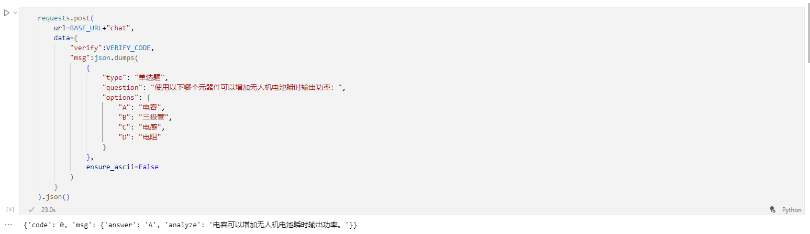
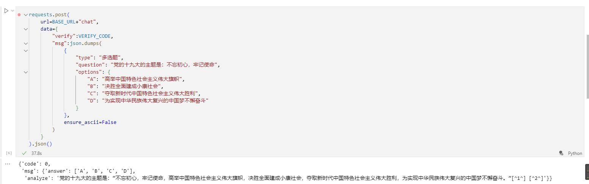
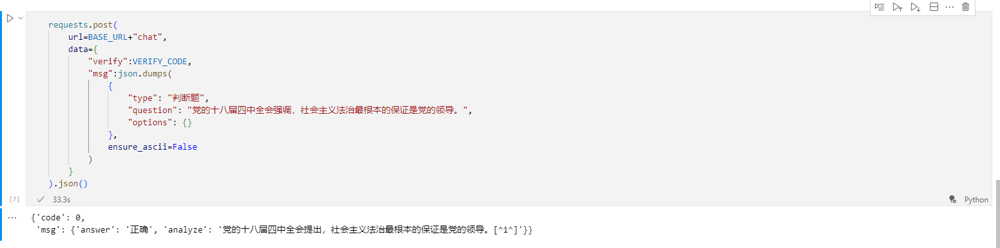
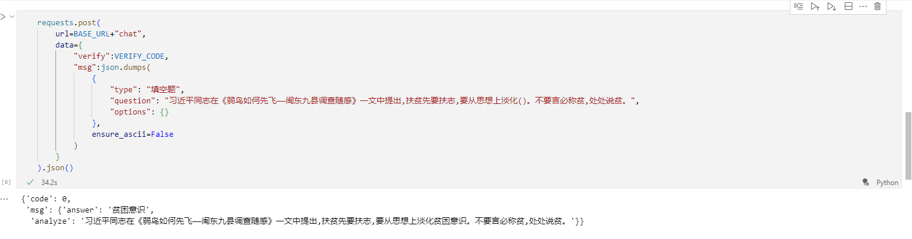

# Question-Api-BingGPT

## 效果图

~~你们可能并不理解我在接某星单时候发现某大题库里搜题100道题就搜出来5道题的心情~~

于是写了一个BingGPT的接口发现，唉能用！先上效果图：









结果就发现，唉！这玩意除了速度慢了一点之外（得看你的网络）都挺好的，谁说BingAI不能自定义的（狗头）

## 使用方法

1. 请换一个好一点的网络
2. 安装Python（我用的环境是3.9.16，但是其他版本大差不差应该也兼容）
3. 首先使用下载本代码（也没多少东西）`https://github.com/Esdrin/Question-Api-BingGPT.git`
4. cd到项目目录后安装依赖`pip install -r requirement.txt`
5. 从Edge浏览器下扒下你的Cookies数据（我是用的是Cookie Editor复制json到剪贴板），并保存到项目目录内，重命名为`cookies.json`
6. 打开`main.py`文件修改里面的全局参数`VERIFY_CODE`,这个玩意用于api的访问认证
7. 在命令行中使用`uvicorn main:app --host 0.0.0.0 --port 5000 --reload`运行本代码

## 友情链接

[Cookie Editor - Microsoft Edge Addons](https://microsoftedge.microsoft.com/addons/detail/cookie-editor/ajfboaconbpkglpfanbmlfgojgndmhmc?hl=zh-CN)
[acheong08/EdgeGPT](https://github.com/acheong08/EdgeGPT)

## API接口

示例代码使用`requests`库实现访问

### /clean

功能： 用于创建新对话

方法:	POST

参数:

    verify : 验证码

示例代码:

```python
requests.post(
    url=BASE_URL+"clean",
    data={
        "verify":VERIFY_CODE
    }
).json()
```

### /first_prompt

功能： 用于导入问答配置

方法:	POST

参数:

    verify : 验证码

示例代码:

```python
requests.post(
    url=BASE_URL+"first_prompt",
    data={
        "verify":VERIFY_CODE
    }
).json()
```

注意：请务必在每次使用完clean的api后重新再调用一遍次api

### /chat

功能： 用于问答

方法: POST

参数:

    verify: 验证码
    
    msg:  json格式数据（请不要转成ascii码）

示例代码:

单选题：

```python
requests.post(
    url=BASE_URL+"chat",
    data={
        "verify":VERIFY_CODE,
        "msg":json.dumps(
            {
                "type": "单选题",
                "question": "使用以下哪个元器件可以增加无人机电池瞬时输出功率：",
                "options": {
                    "A": "电容",
                    "B": "三极管",
                    "C": "电感",
                    "D": "电阻"
                }
            },
            ensure_ascii=False
        )
    }
).json()
```

多选题：

```python
requests.post(
    url=BASE_URL+"chat",
    data={
        "verify":VERIFY_CODE,
        "msg":json.dumps(
            {
                "type": "多选题",
                "question": "党的十九大的主题是：不忘初心，牢记使命",
                "options": {
                    "A": "高举中国特色社会主义伟大旗帜",
                    "B": "决胜全面建成小康社会",
                    "C": "夺取新时代中国特色社会主义伟大胜利",
                    "D": "为实现中华民族伟大复兴的中国梦不懈奋斗"
                }
            },
            ensure_ascii=False
        )
    }
).json()
```

判断题：

```python
requests.post(
    url=BASE_URL+"chat",
    data={
        "verify":VERIFY_CODE,
        "msg":json.dumps(
            {
                "type": "判断题",
                "question": "党的十八届四中全会强调，社会主义法治最根本的保证是党的领导。",
                "options": {}
            },
            ensure_ascii=False
        )
    }
).json()
```

填空题：

```python
requests.post(
    url=BASE_URL+"chat",
    data={
        "verify":VERIFY_CODE,
        "msg":json.dumps(
            {
                "type": "填空题",
                "question": "《弱鸟如何先飞—闽东九县调查随感》一文中提出,扶贫先要扶志,要从思想上淡化()。不要言必称贫,处处说贫。",
                "options": {}
            },
            ensure_ascii=False
        )
    }
).json()
```

## 已知问题

1. 请在单此会话次数结束到的时候刷新一遍配置，没写自动刷新（~~懒~~）
